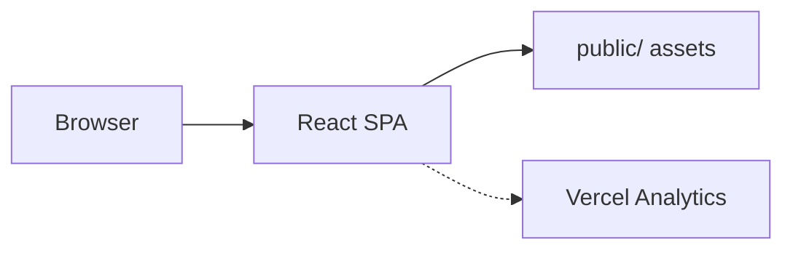

# ROIDEV

**Personal developer portfolio** for Richard Kwaku Opoku — single-page showcase with hero, about, skills, project slideshows, contact links, and CV download.

---

## Table of Contents

- [System Design](#system-design)
- [Features](#features)
- [Technology Stack](#technology-stack)
- [Getting Started](#getting-started)
- [Deployment](#deployment)
- [Project Structure](#project-structure)
- [License](#license)

---

## System Design

A **Create React App (CRA) single-page application** composed of section components with custom CSS design tokens. No backend — contact links are client-side. Vercel Analytics tracks page views in production.



| Layer | Role |
|-------|------|
| **App.js** | Section composition and scroll layout |
| **Components** | Navbar, Hero, About, Skills, Projects, Contact, Footer |
| **styles/** | Design tokens, base, layout, animations |
| **public/** | Project screenshots, CV PDF |

> **Note:** Built with **Create React App + JavaScript + custom CSS**, not Next.js or TypeScript.

---

## Features

- Single-page layout with smooth section navigation
- Project cards with image slideshows and live/GitHub links
- Contact methods: email, LinkedIn, GitHub, WhatsApp, phone
- CV download (`public/RICHARD KWAKU OPOKU.pdf`)
- Scroll-to-top button
- Vercel Analytics integration

---

## Technology Stack

| Component | Technology |
|-----------|------------|
| Framework | Create React App (react-scripts 5) |
| UI | React 18, plain JavaScript |
| Styling | Custom CSS (tokens, layout, animations) |
| Icons | Font Awesome, react-icons |
| Analytics | @vercel/analytics |

---

## Getting Started

### Prerequisites

- Node.js 16+

### Install and run

```bash
npm install
npm start
# → http://localhost:3000

npm run build    # production build → build/
npm test
```

---

## Deployment

| Platform | Config |
|----------|--------|
| **Vercel** | `vercel.json` — SPA rewrite to `index.html` |
| **Netlify** | `netlify.toml` — build `build/`, SPA redirect |
| **GitHub Pages** | `npm run deploy` (uses `gh-pages`) |

No environment variables required.

---

## Project Structure

```
ROIDEV/
├── src/
│   ├── index.js, App.js
│   ├── Navbar.js, Hero.js, About.js, Skills.js
│   ├── Projects.js, Contact.js, Footer.js
│   └── styles/
├── public/images/
├── package.json
├── vercel.json
└── netlify.toml
```

---

## License

See repository for license terms.
